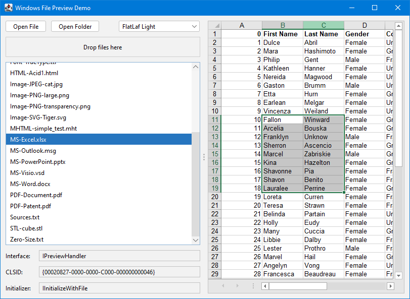
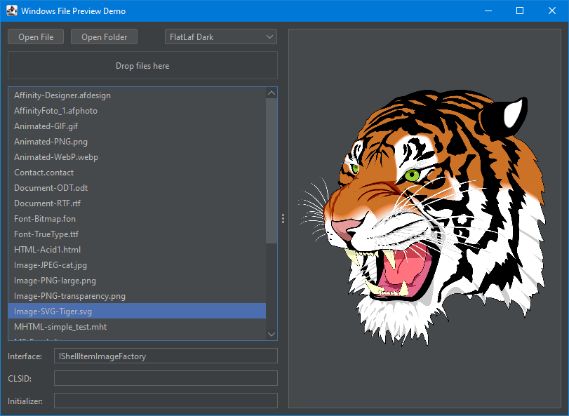

# Windows File Preview for Java

A Java library for native file preview on Windows using JNA.

## Screenshots

	 

## Features

- Simple AWT/Swing integration, based on AWT Canvas
- Hosts interactive previews if `IPreviewHandler` is available
- Falls back to static thumbnails via `IThumbnailProvider` and `IShellItemImageFactory`
- Supports initialization via `IInitializeWithFile`, `IInitializeWithStream`, and `IInitializeWithItem`
- Supports customization via `IPreviewHandlersVisuals`
- Launches the default registered application when a thumbnail is double-clicked (as in Windows Explorer)
- Supports dark themes and adapts to Look & Feel changes at runtime
- Shows a checkered background on mouse over (optional)
- Uses double-buffering to avoid flickering
- Uses a separate thread for each handler, for stability and performance

## Requirements

- Java 8 or later
- JNA 5.x
- Windows 7, 8, 10, 11

## Usage

Copy `WindowsPreviewCanvas.java` and `.properties` files to your project and add JNA as a dependency. Add your own localization, if desired.

## Example

	public static void main(String[] args) {
		SwingUtilities.invokeLater(() -> {
			JFrame frame = new JFrame("Windows File Preview Example");
			WindowsPreviewCanvas canvas = new WindowsPreviewCanvas();
			frame.setDefaultCloseOperation(JFrame.EXIT_ON_CLOSE);
			frame.add(canvas);
			frame.setSize(800, 600);
			frame.setLocationRelativeTo(null);
			frame.setVisible(true);
			canvas.showPreview(new File("C:\\Windows\\Help\\en-US\\credits.rtf"));
		});
	}

## Known issues and limitations

- Sometimes Windows renders transparent pixels as black
- Does not remove focus from AWT/Swing when `IPreviewHandler` gets focus
- Does not implement accelerator handling
- On 32-bit Java, some thumbnail providers do not work (e.g. Affinity Thumbnail Handler);
  a thumbnail will only be shown if Windows already has it cached
